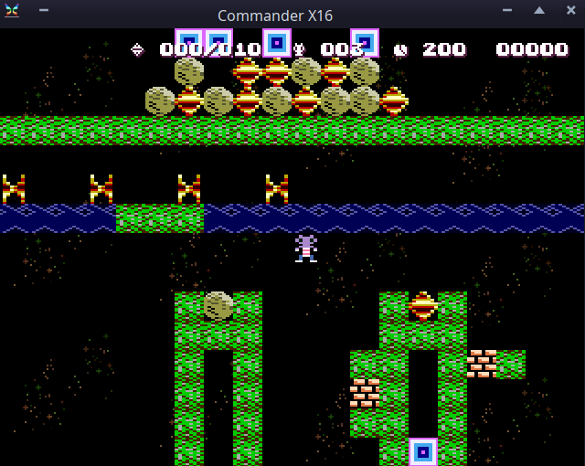

Rock Runner
===========

A Boulder Dash® clone for the Commander X16, written in [Prog8](https://prog8.readthedocs.io).

Original Boulder Dash® in 1984 by First Star Software, created by Peter Liepa and Chris Gray.
Copyright by BBG Entertainment GmbH.

The graphics tile set is from MIT-licensed GDash and is based on Boulder Rush by Michael Kowalski / Miksoft. See below for links.

Custom Level files ('cavesets')
-------------------------------

The "CAVES" subdirectory contains a bunch of fan-made cavesets,
but also the original Boulderdash 1 and Boulderdash 2 caves.
The game starts up with the Boulderdash 1 caves ("BOULDERDASH01.BD"), but you can load a different cave set from the menu if you want.
You can also add more cavesets in this subdirectory by simply copying the files in there. Make sure the files are in the BDCFF text format.
Hundreds of cavesets can be freely obtained from https://boulderdash.nl/ in the BDCFF section.
Note: due to slight engine incompatibilities, not all fan made levels may be loadable or solvable.

Game crashes after loading a custom level. What do?
---------------------------------------------------

The engine doesn't support all features that were designed after the original game came out.
When it detects something it cannot handle, it usually places a 1-byte error code in memory and aborts the game
into the monitor.
If this happens, inspect the memory at `$0400` to see what error byte is stored there (the A register should also contain this error code).
You can then search in the source code for calls to `error_abort` to check what the error code means. 
For example, error code `$86` means that a cave in the caveset file is larger than the maximum allowed size (40 by 22).

How to play the game
--------------------

Pick up enough diamonds in the
cave to unlock the exit, and
reach it before the time runs out.
Avoid enemies and getting crushed.
Control the game using any joypad
(start button activates).
Fire+direction lets you grab
something without moving there!
Press ESC when you're stuck: this
restarts the level (losing a life)

For more details refer to the manual of the original Boulder Dash game: https://archive.org/details/Boulder_Dash_1984_First_Star_Software/
It explains the game and the various inhabitants of the caves you encounter.

TODO
----

- Improve titlescreen:  dim the colors of the scrolling block background temporarily to make the text more legible

- BUG: explodingdash.bd cave 1 (or 0-test cave C) on the right side: the explosions keep restarting  into a giant column of flame
  caused by the way animations are done: they're global for the tile *type* (explosion in this case)
  and get restarted for all tiles that are still going in the animation.
  Solution: rewrite the tile animation system to track animation frame per tile in the matrix, instead of per tile *type*
  Can this be embedded into the attribute matrix or does it need a new matrix?
  In objects.p8 (generated!) at the bottom are the old anim tracking arrays that probably should be replaced.

- codesize: screen.hud_text() is called MANY times in a row, this eats code space. Make a table of subsequent strings, and parse that in a loop perhaps?
- feature: describe the basic game mechanics somewhere in the readme for new players.
- feature: tweak the controls to also register joystick buttons a few frames before the actual cavescan - does this make it more responsive? or just more laggy? 
- feature: "CaveDelay" is currently not parsed. This causes the wrong cave speed for some levels, such as arnodash4 cave E (first intermission) where rockford spawns and immediately dies because of a firefly explosion. See parse_cave().
- feature: scroll overflowing filename list in the load caveset screen
- feature: touch up the tileset to real 16x16 graphics? starting with diamonds and boulders then Rockford then the rest
- feature: selectable tilesets?  also add the real c64 retro tileset with the adjustable palette per cave?
- feature: easter egg: replace butterfly with X16 logo (how to trigger?)
- feature: better title tune (@Crisps?)
- feature: better sound effects for the random sounds (Use random tones from a scale rather than totally random frequencies?)

Development Resources
---------------------

* https://www.boulder-dash.nl/
* https://www.elmerproductions.com/sp/peterb/
* https://www.elmerproductions.com/sp/peterb/BDCFF/index.html
* https://www.elmerproductions.com/sp/peterb/insideBoulderdash.html
* https://www.elmerproductions.com/sp/peterb/sounds.html#Theme%20tune
* http://www.emeraldmines.net/BDCFF/
* https://www.boulder-dash.nl/bdcff_doc.html
* http://www.gratissaugen.de/erbsen/bdcff.html
* http://www.gratissaugen.de/erbsen/BD-Inside-FAQ.html
* https://codeincomplete.com/articles/javascript-boulderdash/
* https://codeincomplete.com/articles/javascript-boulderdash/objects.pdf
* https://codeincomplete.com/articles/javascript-boulderdash/sounds.pdf
* https://codeincomplete.com/articles/javascript-boulderdash/raw_cave_data.pdf
* http://www.bd-fans.com/FanStuff.html#Programming
* https://github.com/Agetian/bouldercaves
* https://github.com/irmen/bouldercaves
* https://bitbucket.org/czirkoszoltan/gdash/
* https://bitbucket.org/czirkoszoltan/gdash/src/c8390151fb1181a7d8c81df8eab67ab2cbf018e0/src/misc/helptext.cpp#lines-223

